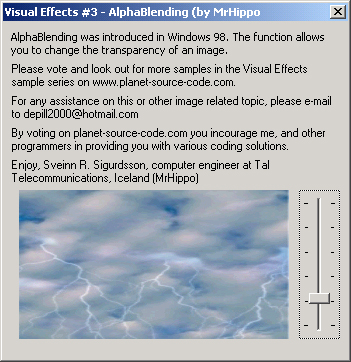

<div align="center">

## VisualEffects \#3 \- The AlphaBlending \(by MrHippo\)


</div>

### Description

And now for the 3rd sample in the popular VisualEffects series, the AlphaBlending. Alphablending tehnique was introduced in Windows 98. It allows you to blend two images smoothly by selecting image's transparency. Well commented and don't forget to check out VisualEffects #1 & #2, the translucency and transparency. Also, if like it or not, please vote & comment and encourage me and all of us to keep on providing each other with coded solutions. Thank you, MrHippo
 
### More Info
 


<span>             |<span>
---                |---
**Submitted On**   |2001-01-08 18:57:58
**By**             |[N/A](https://github.com/Planet-Source-Code/PSCIndex/blob/master/ByAuthor/empty.md)
**Level**          |Intermediate
**User Rating**    |4.6 (46 globes from 10 users)
**Compatibility**  |VB 6\.0
**Category**       |[Graphics](https://github.com/Planet-Source-Code/PSCIndex/blob/master/ByCategory/graphics__1-46.md)
**World**          |[Visual Basic](https://github.com/Planet-Source-Code/PSCIndex/blob/master/ByWorld/visual-basic.md)
**Archive File**   |[CODE\_UPLOAD13543182001\.zip](https://github.com/Planet-Source-Code/visualeffects-3-the-alphablending-by-mrhippo__1-14250/archive/master.zip)

### API Declarations

```
' API DECLARATION [ ALPHA BLEND FUNCTION ]
Private Declare Function AlphaBlend Lib "msimg32" ( _
ByVal hDestDC As Long, ByVal x As Long, ByVal y As Long, _
ByVal nWidth As Long, ByVal nHeight As Long, ByVal hSrcDC As Long, _
ByVal xSrc As Long, ByVal ySrc As Long, ByVal widthSrc As Long, _
ByVal heightSrc As Long, ByVal blendFunct As Long) As Boolean
' API DECLARATIONS [ COPY MEMORY FUNCTION ]
Private Declare Sub CopyMemory Lib "kernel32" Alias "RtlMoveMemory" ( _
Destination As Any, Source As Any, ByVal Length As Long)
```


